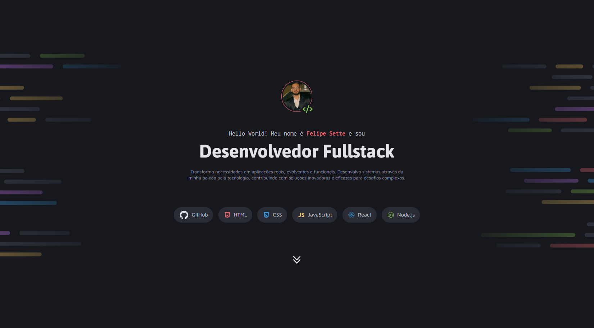

# Repositório Desafio - Portfólio Dev

🚀 Um repositório destinado para o desafio prático Portfólio Dev da jornada do curso **Full-Stack** da Rocketseat, ministrado pelo Mayk Brito. ⚒

> Formação Full-Stack: [Nível 4] Avançando no HTML e CSS (Desafio Prático)

O site desenvolvido é um portfólio para desenvolvedores, com o intuito de mostrar os projetos desenvolvidos e o contato profissional.

[🔗 Veja o projeto](fesette.github.io/Portfolio-dev/)

## 🛠️ Tecnologias

- HTML
- CSS
- Git e Github